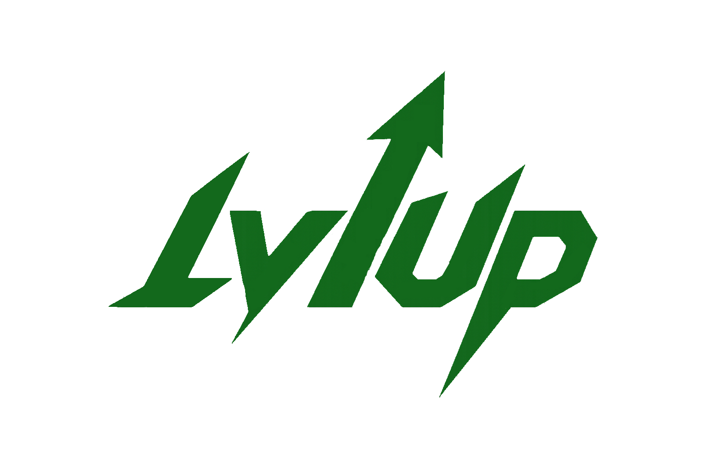

#  LvlUp — Oyun Haberleri & Topluluk Platformu

[](https://vercel.com)
[](#)
[](#)
[](#)
[](#)

**LvlUp**, oyun dünyasına dair en son haberleri takip edebileceğiniz, oyun fiyatlarını karşılaştırabileceğiniz, diğer oyuncularla etkileşime girebileceğiniz ve doğrudan tarayıcınız üzerinden klasik oyunlar oynayabileceğiniz modern ve Türkçe dilinde geliştirilmiş bir **topluluk platformudur**.

Tamamen **istemci taraflı (client-side)** çalışan bir Tek Sayfa Uygulaması (SPA) olup, veri tabanı veya sunucu kurulumu gerektirmeden tüm verileri tarayıcınızın `localStorage` alanında depolar.

---

## 🌟 Öne Çıkan Özellikler

### 💬 Sosyal Akış & Topluluk
* **Dinamik Gönderi Akışı:** Yeni, popüler ve en çok tartışılan gönderilere göre sıralama seçenekleri.
* **Kategorize Edilmiş İçerikler:** FPS, RPG, MOBA, Battle Royale, Indie, Strateji ve Genel kategorilerinde gönderi paylaşımı ve filtreleme.
* **Sosyal Etkileşim:** Gönderileri ve yorumları beğenme, yer imlerine (bookmark) ekleme, yorum sistemi ve bildirimler.
* **Kişiselleştirilebilir Profil:** Banner ve avatar gradyanı değiştirme, biyografi yazma ve favori oyunu belirleme.
* **Demo Kullanıcılar:** Test edebilmeniz için 5 adet hazır demo hesabı (`pro`, `pixel`, `neo`, `cyber`, `star` @lvlup.com / Şifre: `123456`).

### 🎮 Oyun Veritabanı & Fiyat Karşılaştırma
* **RAWG API Entegrasyonu:** Metacritic puanlarına göre sıralanmış güncel oyun arşivi, sayfalama (pagination) ve detaylı oyun kartları.
* **ITAD (IsThereAnyDeal) v2 Entegrasyonu:** Oyunların Türkiye bölgesi fiyatlarını karşılaştırma, indirim oranları ve direkt mağaza (Steam, Epic, Humble vs.) linkleri.
* **Lightbox Görsel Galerisi:** Oyun detay sayfalarında oyun içi ekran görüntülerini büyütebileceğiniz şık galeri.

### 🕹️ Tarayıcı İçi Oyunlar
* **Mayın Tarlası (Minesweeper):** Web Audio API ile zenginleştirilmiş ses efektleri, kolay-orta-zor zorluk seçenekleri ve bayraklama kontrolleri.
* **Sudoku:** Tarayıcı üzerinden doğrudan oynayabileceğiniz etkileşimli Sudoku oyunu.

### 🔍 Akıllı Arama & Arayüz
* **Global Arama (`Ctrl+K` veya `Cmd+K`):** Kullanıcıları, oyunları, gönderileri ve incelemeleri içeren otomatik tamamlamalı arama penceresi.
* **Arayüz Tasarımı:** Göz yormayan şık Dark Mode, yarı şeffaf Glassmorphism kart tasarımları ve akıcı mikro-animasyonlar.

---

## 🛠️ Kullanılan Teknolojiler

| Katman | Teknoloji | Açıklama |
| :--- | :--- | :--- |
| **Markup** | HTML5 | Semantik yapı ve Türkçe dil desteği (`lang="tr"`) |
| **Stil** | CSS3 | Custom CSS Properties, Flexbox, Grid, Backdrop-Filter |
| **Mantık** | Vanilla JavaScript | ES6+ standartları, modüler yapı |
| **Veri Depolama** | `localStorage` | İstemci tarafında kalıcı session ve veri yönetimi |
| **Fontlar** | Google Fonts | Inter (arayüz), Audiowide & Orbitron (başlıklar) |
| **Ses Motoru** | Web Audio API | Mayın tarlası oyunu için sentezlenmiş ses efektleri |
| **Yönlendirme** | Hash Routing | `#home`, `#games`, `#profile` gibi hash tabanlı SPA yapısı |
| **Dış Servisler** | REST API'ler | RAWG API & IsThereAnyDeal API v2 |

---

## 📂 Proje Klasör Yapısı

```text
LvlUp/
├── index.html              # Ana uygulama (SPA giriş noktası)
├── plan.md                 # Proje planı ve detaylı teknik notlar
├── vercel.json             # Vercel sunucusuz dağıtım yapılandırması
│
├── api/
│   └── config.js           # API proxy yapılandırması ve anahtarları
│
├── assets/
│   ├── css/
│   │   └── style.css       # Projenin tüm görsel stilleri (~78 KB, Glassmorphism & Dark Tema)
│   ├── js/
│   │   └── app.js          # Uygulama mantığı ve localStorage yönetimi (~116 KB)
│   └── images/
│       ├── logo.png        # LvlUp logosu
│       ├── favicon.png     # Tarayıcı favicon simgesi
│       └── treeman.png     # İleride kullanılacak dekoratif görsel
│
└── games/
    ├── minesweeper.html    # Mayın Tarlası oyunu (Bağımsız sayfa)
    └── sudoku.html         # Sudoku oyunu (Bağımsız sayfa)
```

---

## 🚀 Kurulum ve Çalıştırma

LvlUp, herhangi bir derleme (build) veya paket yöneticisi (`npm`) gerektirmez. Doğrudan tarayıcıda çalıştırabilirsiniz.

### Seçenek 1: Doğrudan Çalıştırma
Projeyi bilgisayarınıza indirdikten sonra `index.html` dosyasına çift tıklayarak tarayıcınızda açabilirsiniz.

### Seçenek 2: Yerel Sunucu (Tavsiye Edilen)
API isteklerinin daha stabil çalışması için projeyi bir yerel sunucu (Local Server) ile çalıştırmanız önerilir.
Eğer bilgisayarınızda **Node.js** yüklü ise:
```bash
# Proje klasörüne girin
cd LvlUp

# Basit bir HTTP sunucusu başlatın
npx serve .
```
Tarayıcınızda `http://localhost:3000` adresine giderek uygulamaya erişebilirsiniz.

---

## 🔑 API Yapılandırması

Oyun veritabanının ve fiyatların sorunsuz çekilebilmesi için API anahtarlarınızı `api/config.js` dosyasında tanımlamalısınız:

```javascript
// api/config.js
export const API_KEYS = {
    RAWG: 'SİZİN_RAWG_API_ANAHTARINIZ',
    ITAD: 'SİZİN_ITAD_API_ANAHTARINIZ'
};
```
* **RAWG API Anahtarı:** [rawg.io/apidocs](https://rawg.io/apidocs) adresinden ücretsiz alabilirsiniz.
* **IsThereAnyDeal API Anahtarı:** [isthereanydeal.com](https://isthereanydeal.com/) geliştirici panelinden temin edilebilir.

---

## 🗺️ Yol Haritası (Roadmap)

- [ ] **Optimizasyon & Refactoring:** Yinelenen JS kodlarının sadeleştirilmesi ve performans optimizasyonu.
- [ ] **Dil Desteği & Çeviri:** Oyun açıklamalarının DeepL API aracılığıyla otomatik Türkçeye çevrilmesi.
- [ ] **ITAD Entegrasyon İyileştirmesi:** Fiyatların Türkiye bölgesi için daha kararlı ve hızlı getirilmesi.
- [ ] **Çoklu Tema Seçenekleri:**
  - 🌲 **Orman Teması (Varsayılan):** Yeşil tonlar ve animasyonlu yapraklar (Ben 10 Vahşi Asma yukarı oku).
  - 🌊 **Okyanus Teması:** Mavi tonlar ve su dalgası animasyonları (Ben 10 Yüzen Çene yukarı oku).
  - 🏜️ **Çöl Teması:** Sarı/Turuncu tonlar ve kum fırtınası efekti (Ben 10 Mumya yukarı oku).
  - 🌌 **Uzay Teması:** Siyah tonlar ve yıldız kayması efektleri (Ben 10 Uzaylı X yukarı oku).
- [ ] **Yeni Tarayıcı Oyunları:** Block Blast, Yılan, Dinozor ve Satranç gibi yeni oyunların iframe olarak eklenmesi.

---

## 📜 Lisans

Bu proje kişisel gelişim ve eğitim amacıyla geliştirilmiştir. Kodlarını inceleyebilir, değiştirebilir ve kendi projelerinizde kullanabilirsiniz.
